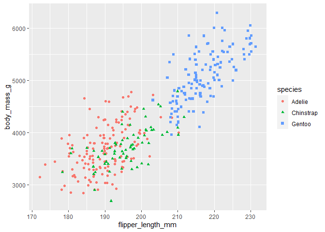

Visualization data with ggplot2
================

``` r
library(tidyverse)
library(palmerpenguins)
```

``` r
data(penguins)
head(penguins, 5)
```

    ## # A tibble: 5 × 8
    ##   species island    bill_length_mm bill_depth_mm flipper_length_mm body_mass_g
    ##   <fct>   <fct>              <dbl>         <dbl>             <int>       <int>
    ## 1 Adelie  Torgersen           39.1          18.7               181        3750
    ## 2 Adelie  Torgersen           39.5          17.4               186        3800
    ## 3 Adelie  Torgersen           40.3          18                 195        3250
    ## 4 Adelie  Torgersen           NA            NA                  NA          NA
    ## 5 Adelie  Torgersen           36.7          19.3               193        3450
    ## # ℹ 2 more variables: sex <fct>, year <int>

``` r
glimpse(penguins)
```

    ## Rows: 344
    ## Columns: 8
    ## $ species           <fct> Adelie, Adelie, Adelie, Adelie, Adelie, Adelie, Adel…
    ## $ island            <fct> Torgersen, Torgersen, Torgersen, Torgersen, Torgerse…
    ## $ bill_length_mm    <dbl> 39.1, 39.5, 40.3, NA, 36.7, 39.3, 38.9, 39.2, 34.1, …
    ## $ bill_depth_mm     <dbl> 18.7, 17.4, 18.0, NA, 19.3, 20.6, 17.8, 19.6, 18.1, …
    ## $ flipper_length_mm <int> 181, 186, 195, NA, 193, 190, 181, 195, 193, 190, 186…
    ## $ body_mass_g       <int> 3750, 3800, 3250, NA, 3450, 3650, 3625, 4675, 3475, …
    ## $ sex               <fct> male, female, female, NA, female, male, female, male…
    ## $ year              <int> 2007, 2007, 2007, 2007, 2007, 2007, 2007, 2007, 2007…

Plot the relationship between body mass and flipper length in the three
penguin species.

### Scatterplot

``` r
ggplot(data = penguins) +
  geom_point(aes(x= flipper_length_mm, y = body_mass_g, shape = species, alpha = 0.8), color = 'purple')
```

    ## Warning: Removed 2 rows containing missing values (`geom_point()`).

<!-- -->

#### Plot with annotation

``` r
ggplot(data = penguins) +
  geom_point(aes(x= flipper_length_mm, y = body_mass_g, color = species, shape = species)) +
  labs(title = "Palmer Penguins: Body Mass vs. Flipper Length",
       subtitle = "Sample of three penguin species",
       caption = "Data collected by Dr. Kristen Gorman") +
  annotate("text", x = 220, y = 3500, label = "The Gentoos are the largest", 
           color = "purple", fontface = "bold", size = 4.5, angle = 25) 
```

    ## Warning: Removed 2 rows containing missing values (`geom_point()`).

<!-- -->

``` r
  #the values of x and y in this annotation function refers to the coordination of the text.
```

\*\*\* We can save the code as a variable in the environment if we want
to use the same code again, so we don’t have to write the same code over
and over again.\*\*\*

### Line graph

``` r
ggplot(data = penguins) +
  geom_smooth(aes(x= flipper_length_mm, y = body_mass_g, linetype = species))
```

    ## `geom_smooth()` using method = 'loess' and formula = 'y ~ x'

    ## Warning: Removed 2 rows containing non-finite values (`stat_smooth()`).

<!-- -->

``` r
ggplot(data = penguins) +
  geom_smooth(aes(x= flipper_length_mm, y = body_mass_g, color = species)) +
  geom_point(aes(x= flipper_length_mm, y = body_mass_g, color = species))
```

    ## `geom_smooth()` using method = 'loess' and formula = 'y ~ x'

    ## Warning: Removed 2 rows containing non-finite values (`stat_smooth()`).

    ## Warning: Removed 2 rows containing missing values (`geom_point()`).

<!-- -->

### Jittering

``` r
ggplot(data = penguins) +
  geom_jitter(aes(x= flipper_length_mm, y = body_mass_g, color = species, shape = species))
```

    ## Warning: Removed 2 rows containing missing values (`geom_point()`).

<!-- -->

### Bar chart

``` r
ggplot(data = diamonds) +
  geom_bar(aes(x = cut, fill = clarity))
```

<!-- -->

### Facet\_ functions

#### `facet_wrap()` - Separate by categories within one variable

``` r
ggplot(data = penguins) + 
  geom_point(aes(x = flipper_length_mm, y = body_mass_g, color = species)) +
  facet_wrap(~species)
```

    ## Warning: Removed 2 rows containing missing values (`geom_point()`).

<!-- -->

``` r
ggplot(data = diamonds) +
  geom_bar(aes(x = color, fill = cut)) +
  facet_wrap(~cut)
```

<!-- -->

#### `facet_grid()` - Separate by categories of two variables (can also do one variable)

``` r
ggplot(data = penguins) +
  geom_point(aes(x = flipper_length_mm, y = body_mass_g, color = species)) +
  facet_grid(~sex)
```

    ## Warning: Removed 2 rows containing missing values (`geom_point()`).

<!-- -->

``` r
ggplot(data = penguins) +
  geom_point(aes(x = flipper_length_mm, y = body_mass_g, color = species)) +
  facet_grid(~species)
```

    ## Warning: Removed 2 rows containing missing values (`geom_point()`).

<!-- -->

# Hands-On Activity 1

## Background for this activity

In this activity, you’ll review a scenario, and use ggplot2 to quickly
create data visualizations that allow you to explore your data and gain
new insights. You will learn more about basic ggplot2 syntax and data
visualization in R.

Throughout this activity, you will also have the opportunity to practice
writing your own code by making changes to the code chunks yourself. If
you encounter an error or get stuck, you can always check the
Lesson2_GGPlot_Solutions .rmd file in the Solutions folder under Week 4
for the complete, correct code.

## The Scenario

In this scenario, you are a junior data analyst working for a hotel
booking company. You have cleaned and manipulated your data, and gotten
some initial insights you would like to share. Now, you are going to
create some simple data visualizations with the `ggplot2` package. You
will use basic `ggplot2` syntax and troubleshoot some common errors you
might encounter.

## Step 1: Import your data

``` r
hotel_bookings <- read_csv("./Data/hotel_bookings.csv")
```

## Step 2: Look at a sample of your data

Use the `head()` function to preview your data:

``` r
head(hotel_bookings)
```

    ## # A tibble: 6 × 32
    ##   hotel        is_canceled lead_time arrival_date_year arrival_date_month
    ##   <chr>              <dbl>     <dbl>             <dbl> <chr>             
    ## 1 Resort Hotel           0       342              2015 July              
    ## 2 Resort Hotel           0       737              2015 July              
    ## 3 Resort Hotel           0         7              2015 July              
    ## 4 Resort Hotel           0        13              2015 July              
    ## 5 Resort Hotel           0        14              2015 July              
    ## 6 Resort Hotel           0        14              2015 July              
    ## # ℹ 27 more variables: arrival_date_week_number <dbl>,
    ## #   arrival_date_day_of_month <dbl>, stays_in_weekend_nights <dbl>,
    ## #   stays_in_week_nights <dbl>, adults <dbl>, children <dbl>, babies <dbl>,
    ## #   meal <chr>, country <chr>, market_segment <chr>,
    ## #   distribution_channel <chr>, is_repeated_guest <dbl>,
    ## #   previous_cancellations <dbl>, previous_bookings_not_canceled <dbl>,
    ## #   reserved_room_type <chr>, assigned_room_type <chr>, …

You can also use `colnames()` to get the names of all the columns in
your data set. Run the code chunk below to find out the column names in
this data set:

``` r
colnames(hotel_bookings)
```

    ##  [1] "hotel"                          "is_canceled"                   
    ##  [3] "lead_time"                      "arrival_date_year"             
    ##  [5] "arrival_date_month"             "arrival_date_week_number"      
    ##  [7] "arrival_date_day_of_month"      "stays_in_weekend_nights"       
    ##  [9] "stays_in_week_nights"           "adults"                        
    ## [11] "children"                       "babies"                        
    ## [13] "meal"                           "country"                       
    ## [15] "market_segment"                 "distribution_channel"          
    ## [17] "is_repeated_guest"              "previous_cancellations"        
    ## [19] "previous_bookings_not_canceled" "reserved_room_type"            
    ## [21] "assigned_room_type"             "booking_changes"               
    ## [23] "deposit_type"                   "agent"                         
    ## [25] "company"                        "days_in_waiting_list"          
    ## [27] "customer_type"                  "adr"                           
    ## [29] "required_car_parking_spaces"    "total_of_special_requests"     
    ## [31] "reservation_status"             "reservation_status_date"

## Step 3: Load the ‘ggplot2’ package

## Step 4: Begin creating a plot

A stakeholder tells you, “*I want to target people who book early, and I
have a hypothesis that people with children have to book in advance.*”

When you start to explore the data, it doesn’t show what you would
expect. That is why you decide to create a visualization to see how true
that statement is– or isn’t.

You can use `ggplot2` to do this. Try running the code below:

``` r
ggplot(data = hotel_bookings) +
  geom_point(mapping = aes(x = lead_time, y = children))
```

    ## Warning: Removed 4 rows containing missing values (`geom_point()`).

<!-- -->

The geom_point() function uses points to create a scatterplot.
Scatterplots are useful for showing the relationship between two numeric
variables. In this case, the code maps the variable ‘lead_time’ to the
x-axis and the variable ‘children’ to the y-axis.

On the x-axis, the plot shows how far in advance a booking is made, with
the bookings furthest to the right happening the most in advance. On the
y-axis it shows how many children there are in a party.

The plot reveals that your stakeholder’s hypothesis is incorrect. You
report back to your stakeholder that many of the advanced bookings are
being made by people with 0 children.

## Step 5: Try it on your own

Next, your stakeholder says that she wants to increase weekend bookings,
an important source of revenue for the hotel. Your stakeholder wants to
know **what group of guests book the most weekend nights** in order to
target that group in a new marketing campaign. She suggests that *guests
without children book the most weekend nights*. Is this true?

Try mapping ‘stays_in_weekend_nights’ on the x-axis and ‘children’ on
the y-axis by filling out the remainder of the code below.

``` r
ggplot(data = hotel_bookings) +
 geom_point(mapping = aes(x = stays_in_weekend_nights, y = children))
```

    ## Warning: Removed 4 rows containing missing values (`geom_point()`).

<!-- -->

If you correctly enter this code, you should have a scatterplot with
‘stays_in_weekend_nights’ on the x-axis and ‘children’ on the y-axis.

What did you discover? Is your stakeholder correct?

What other types of plots could you use to show this relationship?

Remember, if you’re having trouble filling out a code block, check the
solutions document for this activity.

## Activity Wrap Up

The `ggplot2` package allows you to quickly create data visualizations
that can answer questions and give you insights about your data. Now
that you are a little more familiar with the basic `ggplot2` syntax, you
can practice these skills by modifying the code chunks in the rmd file,
or use this code as a starting point in your own project console. With
`ggplot2`, you will be able to create and share data visualizations
without leaving your `R` console. You will learn more about `ggplot2`
throughout this course and eventually create even more complex and
beautiful visualizations!

# Hands-On Activity 2

## Background for this activity

In this activity, you’ll review a scenario, and continue to apply your
knowledge of data visualization with ggplot2. You will learn more about
the aesthetic features of visualizations and how to customize them by
specific criteria.

Throughout this activity, you will also have the opportunity to practice
writing your own code by making changes to the code chunks yourself. If
you encounter an error or get stuck, you can always check the
Lesson3_Aesthetics_Solutions .rmd file in the Solutions folder under
Week 4 for the complete, correct code.

## The Scenario

In this example, you are a junior data analyst working for the same
hotel booking company from earlier. Last time, you created some simple
visualizations with `ggplot2` to give your stakeholders quick insights
into your data. Now, you are are interested in creating visualizations
that highlight different aspects of the data to present to your
stakeholder. You are going to expand on what you have already learned
about `ggplot2` and create new kinds of visualizations like bar charts.

## Making a Bar Chart

Your stakeholder is interested in developing promotions based on
different booking distributions, but first they need to know **how many
of the transactions are occurring for each different distribution
type**.

``` r
ggplot(data = hotel_bookings) +
  geom_bar(mapping = aes(x = distribution_channel))
```

<!-- -->

## Practice quiz

Use the bar chart you created to answer this question: what distribution
type has the most number of bookings? Note your answer for the practice
quiz question in Coursera afterwards.

**A: TA/TO** B: Direct C: GDS D: Corporate

## Diving deeper into bar charts

After exploring your bar chart, your stakeholder has more questions. Now
they want to know **if the number of bookings for each distribution type
is different depending on whether or not there was a deposit or what
market segment they represent**.

``` r
ggplot(data = hotel_bookings) +
  geom_bar(mapping = aes(x = distribution_channel, fill = deposit_type))
```

<!-- -->

Now try adding ‘fill = market_segment’ to this code chunk instead of
‘fill = deposit_type’:

``` r
ggplot(data = hotel_bookings) +
  geom_bar(mapping = aes(x = distribution_channel, fill = market_segment))
```

<!-- -->

## Facets galore

After reviewing the new charts, your stakeholder asks you to create
separate charts for each deposit type and market segment to help them
understand the differences more clearly.

You know that the `facet_` function can do this very quickly.

Add ‘deposit_type’ after the ‘~’ symbol in the code chunk below to
create a different chart for each deposit type:

``` r
ggplot(data = hotel_bookings) +
  geom_bar(mapping = aes(x = distribution_channel)) +
  facet_wrap(~deposit_type)
```

<!-- -->

This code chunk creates three bar charts for ‘no_deposit’, non_refund’,
and ‘refundable’ deposit types. You notice that it’s hard to read the
x-axis labels here, so you add one piece of code at the end that rotates
the text to 45 degrees to make it easier to read.

Try it out below:

``` r
ggplot(data = hotel_bookings) +
  geom_bar(mapping = aes(x = distribution_channel)) +
  facet_wrap(~deposit_type) +
  theme(axis.text.x = element_text(angle = 45))
```

<!-- -->
This code chunk creates a similar bar chart to the previous chunk, but
now the labels on the x axis with the different distribution channels
are clearer.

You can use the same syntax to create a different chart for each market
segment:

``` r
ggplot(data = hotel_bookings) +
  geom_bar(mapping = aes(x = distribution_channel)) +
  facet_wrap(~market_segment) +
  theme(axis.text.x = element_text(angle = 45))
```

<!-- -->

The `facet_grid` function does something similar. The main difference is
that **`facet_grid` will include plots even if they are empty**. Run the
code chunk below to check it out:

``` r
ggplot(data = hotel_bookings) +
  geom_bar(mapping = aes(x = distribution_channel)) +
  facet_grid(~deposit_type) +
  theme(axis.text.x = element_text(angle = 45))
```

<!-- -->
Now you should have three bar charts– but notice that the ‘Refundable’
chart has much less data plotted than the other two.

Now, you could put all of this in one chart and explore the differences
by deposit type and market segment.

Run the code chunk below to find out; notice how the ~ character is
being used before the variables that the chart is being split by:

``` r
ggplot(data = hotel_bookings) +
  geom_bar(mapping = aes(x = distribution_channel)) +
  facet_wrap(~deposit_type~market_segment) +
  theme(axis.text.x = element_text(angle = 45))
```

<!-- -->

These charts are probably overwhelming and too hard to read, but it can
be useful if you are exploring your data through visualizations.

## Activity Wrap Up

The `ggplot2` package allows you to create a variety of visualizations
in `R`, from simple scatter plots to complicated, multi-faceted bar
charts. You can practice these skills by modifying the code chunks in
the rmd file, or use this code as a starting point in your own project
console. As you continue exploring aesthetic arguments in `ggplot2`,
consider how you might use visualizations to gain insights and make
observations about other kinds of data in the future.

# Hands-On Activity 3

## Background for this activity

In this activity, you’ll review a scenario, and practice creating a data
visualization with ggplot2. You will learn how to make use of the
filters and facets features of ggplot2 to create custom visualizations
based on different criteria.

Throughout this activity, you will also have the opportunity to practice
writing your own code by making changes to the code chunks yourself. If
you encounter an error or get stuck, you can always check the
Lesson3_Filters_Solutions .rmd file in the Solutions folder under Week 4
for the complete, correct code.

## The Scenario

As a junior data analyst for a hotel booking company, you have been
asked to clean hotel booking data, create visualizations with `ggplot2`
to gain insight into the data, and present different facets of the data
through visualization. Now, you are going to build on the work you
performed previously to apply filters to your data visualizations in
`ggplot2`.

After considering all the data (in previous activities), your
stakeholder decides to send the promotion to families that make online
bookings for city hotels. The online segment is the fastest growing
segment, and families tend to spend more at city hotels than other types
of guests.

Your stakeholder asks if you can **create a plot that shows the
relationship between lead time and guests traveling with children for
online bookings at city hotels**. This will give her a better idea of
the specific timing for the promotion.

You think about it, and realize you have all the tools you need to
fulfill the request. You break it down into the following two steps: 1)
filtering your data; 2) plotting your filtered data.

``` r
onlineta_city_hotels <- filter(hotel_bookings, 
                           (hotel == "City Hotel" & 
                             hotel_bookings$market_segment == "Online TA"))
```

Note that you can use the ‘&’ character to demonstrate that you want two
different conditions to be true. Also, you can use the ‘\$’ character to
specify which column in the data frame ‘hotel_bookings’ you are
referencing (for example, ‘market_segment’).

You can use the`View`() function to check out your new data frame:

``` r
View(onlineta_city_hotels)
```

There is also another way to do this. You can use the pipe operator
(%\>%) to do this in steps!

You name this data frame `onlineta_city_hotels_v2`:

``` r
onlineta_city_hotels_v2 <- hotel_bookings %>%
  filter(hotel == "City Hotel") %>%
  filter(market_segment == "Online TA")
```

Notice how in the code chunk above, the %\>% symbol is used to note the
logical steps of this code. First, it starts with the name of the data
frame, `onlineta_city_hotels_v2`, AND THEN it tells `R` to start with
the original data frame `hotel_bookings`. Then it tells it to filter on
the ‘hotel’ column; finally, it tells it to filter on the
‘market_segment’ column.

This code chunk generates the same data frame by using the `View()`
function:

``` r
View(onlineta_city_hotels_v2)
```

You can use either of the data frames you created above for your new
plots because they are the same.

Using the code for your previous scatterplot, replace `variable_name` in
the code chunk below with either `onlineta_city_hotels` or
`onlineta_city_hotels_v2` to plot the data your stakeholder requested:

``` r
ggplot(data = onlineta_city_hotels) +
  geom_point(mapping = aes(x = lead_time, y = children))
```

    ## Warning: Removed 1 rows containing missing values (`geom_point()`).

<!-- -->

Based on your previous filter, this scatterplot shows data for online
bookings for city hotels. The plot reveals that bookings with children
tend to have a shorter lead time, and bookings with 3 children have a
significantly shorter lead time (\<200 days). So, promotions targeting
families can be made closer to the valid booking dates.

## Activity Wrap Up

Filters allow you to create different views of your data and allow you
to investigate more specific relationships within your data. You can
practice these skills by modifying the code chunks in the rmd file, or
use this code as a starting point in your own project console. Now that
your stakeholder has had a chance to review these plots, they are
interested in adding annotations they can use to explain the data in a
presentation. Luckily, `ggplot2` has a function that will allow you to
do just that. You will learn more about `ggplot2` in the next activity!

# Extra Tips

- To highlight underperforming products, use an aesthetics function:
  `col = ifelse(x < 2, 'blue', 'yellow')`

- To create a trend line in a scatterplot, add another geom function:
  `geom_smooth()`.

# Save your plot

## Option 1: Export

Under the ‘Plots’ tab, choose the ‘Export’ option and save it as image
or PDF.

## Option 2: `ggsave()`

`ggsave()` automatically save the last plot that was displayed. We have
to give the file a name and tell R what kind of file we want to save it
as.

``` r
ggsave("Three Penguin Species.png")
```
