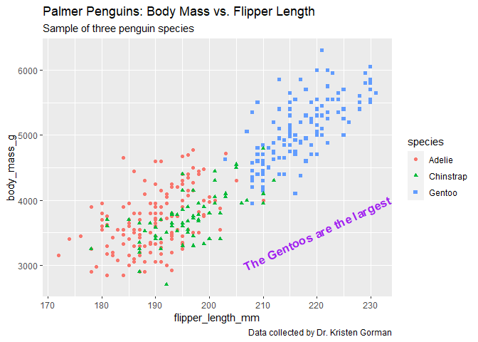

Visualization data with ggplot2
================

``` r
library(tidyverse)
library(palmerpenguins)
```

``` r
data(penguins)
head(penguins, 5)
```

    ## # A tibble: 5 × 8
    ##   species island    bill_length_mm bill_depth_mm flipper_length_mm body_mass_g
    ##   <fct>   <fct>              <dbl>         <dbl>             <int>       <int>
    ## 1 Adelie  Torgersen           39.1          18.7               181        3750
    ## 2 Adelie  Torgersen           39.5          17.4               186        3800
    ## 3 Adelie  Torgersen           40.3          18                 195        3250
    ## 4 Adelie  Torgersen           NA            NA                  NA          NA
    ## 5 Adelie  Torgersen           36.7          19.3               193        3450
    ## # ℹ 2 more variables: sex <fct>, year <int>

``` r
glimpse(penguins)
```

    ## Rows: 344
    ## Columns: 8
    ## $ species           <fct> Adelie, Adelie, Adelie, Adelie, Adelie, Adelie, Adel…
    ## $ island            <fct> Torgersen, Torgersen, Torgersen, Torgersen, Torgerse…
    ## $ bill_length_mm    <dbl> 39.1, 39.5, 40.3, NA, 36.7, 39.3, 38.9, 39.2, 34.1, …
    ## $ bill_depth_mm     <dbl> 18.7, 17.4, 18.0, NA, 19.3, 20.6, 17.8, 19.6, 18.1, …
    ## $ flipper_length_mm <int> 181, 186, 195, NA, 193, 190, 181, 195, 193, 190, 186…
    ## $ body_mass_g       <int> 3750, 3800, 3250, NA, 3450, 3650, 3625, 4675, 3475, …
    ## $ sex               <fct> male, female, female, NA, female, male, female, male…
    ## $ year              <int> 2007, 2007, 2007, 2007, 2007, 2007, 2007, 2007, 2007…

Plot the relationship between body mass and flipper length in the three
penguin species.

``` r
ggplot(data = penguins) +
  geom_point(aes(x= flipper_length_mm, y = body_mass_g, colour = species))
```

    ## Warning: Removed 2 rows containing missing values (`geom_point()`).

<!-- -->

## Background for this activity

In this activity, you’ll review a scenario, and use ggplot2 to quickly
create data visualizations that allow you to explore your data and gain
new insights. You will learn more about basic ggplot2 syntax and data
visualization in R.

Throughout this activity, you will also have the opportunity to practice
writing your own code by making changes to the code chunks yourself. If
you encounter an error or get stuck, you can always check the
Lesson2_GGPlot_Solutions .rmd file in the Solutions folder under Week 4
for the complete, correct code.

## The Scenario

In this scenario, you are a junior data analyst working for a hotel
booking company. You have cleaned and manipulated your data, and gotten
some initial insights you would like to share. Now, you are going to
create some simple data visualizations with the `ggplot2` package. You
will use basic `ggplot2` syntax and troubleshoot some common errors you
might encounter.

## Step 1: Import your data

``` r
hotel_bookings <- read_csv("./Data/hotel_bookings.csv")
```

## Step 2: Look at a sample of your data

Use the `head()` function to preview your data:

``` r
head(hotel_bookings)
```

    ## # A tibble: 6 × 32
    ##   hotel        is_canceled lead_time arrival_date_year arrival_date_month
    ##   <chr>              <dbl>     <dbl>             <dbl> <chr>             
    ## 1 Resort Hotel           0       342              2015 July              
    ## 2 Resort Hotel           0       737              2015 July              
    ## 3 Resort Hotel           0         7              2015 July              
    ## 4 Resort Hotel           0        13              2015 July              
    ## 5 Resort Hotel           0        14              2015 July              
    ## 6 Resort Hotel           0        14              2015 July              
    ## # ℹ 27 more variables: arrival_date_week_number <dbl>,
    ## #   arrival_date_day_of_month <dbl>, stays_in_weekend_nights <dbl>,
    ## #   stays_in_week_nights <dbl>, adults <dbl>, children <dbl>, babies <dbl>,
    ## #   meal <chr>, country <chr>, market_segment <chr>,
    ## #   distribution_channel <chr>, is_repeated_guest <dbl>,
    ## #   previous_cancellations <dbl>, previous_bookings_not_canceled <dbl>,
    ## #   reserved_room_type <chr>, assigned_room_type <chr>, …

You can also use `colnames()` to get the names of all the columns in
your data set. Run the code chunk below to find out the column names in
this data set:

``` r
colnames(hotel_bookings)
```

    ##  [1] "hotel"                          "is_canceled"                   
    ##  [3] "lead_time"                      "arrival_date_year"             
    ##  [5] "arrival_date_month"             "arrival_date_week_number"      
    ##  [7] "arrival_date_day_of_month"      "stays_in_weekend_nights"       
    ##  [9] "stays_in_week_nights"           "adults"                        
    ## [11] "children"                       "babies"                        
    ## [13] "meal"                           "country"                       
    ## [15] "market_segment"                 "distribution_channel"          
    ## [17] "is_repeated_guest"              "previous_cancellations"        
    ## [19] "previous_bookings_not_canceled" "reserved_room_type"            
    ## [21] "assigned_room_type"             "booking_changes"               
    ## [23] "deposit_type"                   "agent"                         
    ## [25] "company"                        "days_in_waiting_list"          
    ## [27] "customer_type"                  "adr"                           
    ## [29] "required_car_parking_spaces"    "total_of_special_requests"     
    ## [31] "reservation_status"             "reservation_status_date"

## Step 3: Load the ‘ggplot2’ package

## Step 4: Begin creating a plot

A stakeholder tells you, “*I want to target people who book early, and I
have a hypothesis that people with children have to book in advance.*”

When you start to explore the data, it doesn’t show what you would
expect. That is why you decide to create a visualization to see how true
that statement is– or isn’t.

You can use `ggplot2` to do this. Try running the code below:

``` r
ggplot(data = hotel_bookings) +
  geom_point(mapping = aes(x = lead_time, y = children))
```

    ## Warning: Removed 4 rows containing missing values (`geom_point()`).

<!-- -->

The geom_point() function uses points to create a scatterplot.
Scatterplots are useful for showing the relationship between two numeric
variables. In this case, the code maps the variable ‘lead_time’ to the
x-axis and the variable ‘children’ to the y-axis.

On the x-axis, the plot shows how far in advance a booking is made, with
the bookings furthest to the right happening the most in advance. On the
y-axis it shows how many children there are in a party.

The plot reveals that your stakeholder’s hypothesis is incorrect. You
report back to your stakeholder that many of the advanced bookings are
being made by people with 0 children.

## Step 5: Try it on your own

Next, your stakeholder says that she wants to increase weekend bookings,
an important source of revenue for the hotel. Your stakeholder wants to
know **what group of guests book the most weekend nights** in order to
target that group in a new marketing campaign. She suggests that *guests
without children book the most weekend nights*. Is this true?

Try mapping ‘stays_in_weekend_nights’ on the x-axis and ‘children’ on
the y-axis by filling out the remainder of the code below.

``` r
ggplot(data = hotel_bookings) +
 geom_point(mapping = aes(x = stays_in_weekend_nights, y = children))
```

    ## Warning: Removed 4 rows containing missing values (`geom_point()`).

<!-- -->

If you correctly enter this code, you should have a scatterplot with
‘stays_in_weekend_nights’ on the x-axis and ‘children’ on the y-axis.

What did you discover? Is your stakeholder correct?

What other types of plots could you use to show this relationship?

Remember, if you’re having trouble filling out a code block, check the
solutions document for this activity.

## Activity Wrap Up

The `ggplot2` package allows you to quickly create data visualizations
that can answer questions and give you insights about your data. Now
that you are a little more familiar with the basic `ggplot2` syntax, you
can practice these skills by modifying the code chunks in the rmd file,
or use this code as a starting point in your own project console. With
`ggplot2`, you will be able to create and share data visualizations
without leaving your `R` console. You will learn more about `ggplot2`
throughout this course and eventually create even more complex and
beautiful visualizations!
