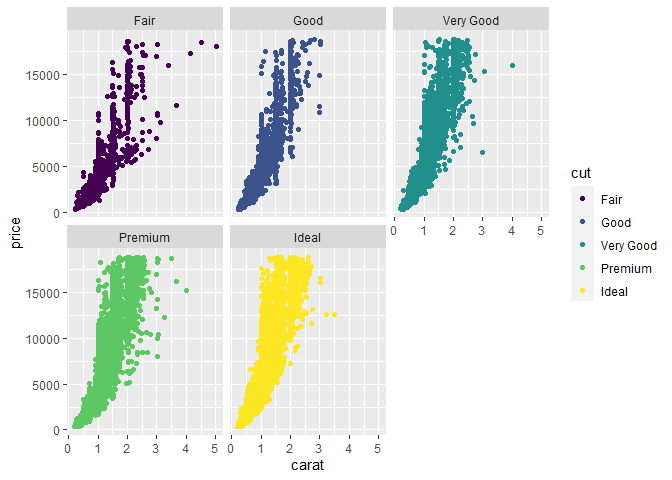

Lesson 3: R Sandbox Activity
================

## Background for this activity

Welcome to the sandbox! This activity is going to provide you with the
opportunity to preview some of the cool things you can do in `R` that
you will be learning in this course. You will learn more about working
with packages and data and try out some important functions.

In this activity, you are going to use functions to view, clean, and
visualize data; and learn more about using `R markdown` to document your
analysis. **R** is a powerful tool that can do a lot of different
things; this sandbox activity will help you get more comfortable using
**R** while demonstrating some of its functions in action. In later
activities, you will also get the opportunity to write your own R code!

# Step 1: Load library

``` r
library(tidyverse)
```

# Step 2: Viewing data

Many of the `tidyverse` packages contain sample datasets that you can
use to practice your `R` skills. The `diamonds` dataset in the `ggplot2`
package is a great example for previewing `R` functions.

Because you already loaded this package in the last step, the `diamonds`
dataset is ready for you to use.

One common function you can use to preview the data is the `head()`
function, which displays the columns and the first several rows of data.
You can test out how the `head()` function works by running the chunk
below:

``` r
head(diamonds)
```

    ## # A tibble: 6 × 10
    ##   carat cut       color clarity depth table price     x     y     z
    ##   <dbl> <ord>     <ord> <ord>   <dbl> <dbl> <int> <dbl> <dbl> <dbl>
    ## 1  0.23 Ideal     E     SI2      61.5    55   326  3.95  3.98  2.43
    ## 2  0.21 Premium   E     SI1      59.8    61   326  3.89  3.84  2.31
    ## 3  0.23 Good      E     VS1      56.9    65   327  4.05  4.07  2.31
    ## 4  0.29 Premium   I     VS2      62.4    58   334  4.2   4.23  2.63
    ## 5  0.31 Good      J     SI2      63.3    58   335  4.34  4.35  2.75
    ## 6  0.24 Very Good J     VVS2     62.8    57   336  3.94  3.96  2.48

In addition to `head()` there are a number of other useful functions you
can use to summarize or preview the data. For example, the `str()` and
`glimpse()` functions will both return summaries of each column in your
data arranged horizontally. You can try out these two functions by
running the code chunks below:

``` r
str(diamonds)
```

    ## tibble [53,940 × 10] (S3: tbl_df/tbl/data.frame)
    ##  $ carat  : num [1:53940] 0.23 0.21 0.23 0.29 0.31 0.24 0.24 0.26 0.22 0.23 ...
    ##  $ cut    : Ord.factor w/ 5 levels "Fair"<"Good"<..: 5 4 2 4 2 3 3 3 1 3 ...
    ##  $ color  : Ord.factor w/ 7 levels "D"<"E"<"F"<"G"<..: 2 2 2 6 7 7 6 5 2 5 ...
    ##  $ clarity: Ord.factor w/ 8 levels "I1"<"SI2"<"SI1"<..: 2 3 5 4 2 6 7 3 4 5 ...
    ##  $ depth  : num [1:53940] 61.5 59.8 56.9 62.4 63.3 62.8 62.3 61.9 65.1 59.4 ...
    ##  $ table  : num [1:53940] 55 61 65 58 58 57 57 55 61 61 ...
    ##  $ price  : int [1:53940] 326 326 327 334 335 336 336 337 337 338 ...
    ##  $ x      : num [1:53940] 3.95 3.89 4.05 4.2 4.34 3.94 3.95 4.07 3.87 4 ...
    ##  $ y      : num [1:53940] 3.98 3.84 4.07 4.23 4.35 3.96 3.98 4.11 3.78 4.05 ...
    ##  $ z      : num [1:53940] 2.43 2.31 2.31 2.63 2.75 2.48 2.47 2.53 2.49 2.39 ...

``` r
glimpse(diamonds)
```

    ## Rows: 53,940
    ## Columns: 10
    ## $ carat   <dbl> 0.23, 0.21, 0.23, 0.29, 0.31, 0.24, 0.24, 0.26, 0.22, 0.23, 0.…
    ## $ cut     <ord> Ideal, Premium, Good, Premium, Good, Very Good, Very Good, Ver…
    ## $ color   <ord> E, E, E, I, J, J, I, H, E, H, J, J, F, J, E, E, I, J, J, J, I,…
    ## $ clarity <ord> SI2, SI1, VS1, VS2, SI2, VVS2, VVS1, SI1, VS2, VS1, SI1, VS1, …
    ## $ depth   <dbl> 61.5, 59.8, 56.9, 62.4, 63.3, 62.8, 62.3, 61.9, 65.1, 59.4, 64…
    ## $ table   <dbl> 55, 61, 65, 58, 58, 57, 57, 55, 61, 61, 55, 56, 61, 54, 62, 58…
    ## $ price   <int> 326, 326, 327, 334, 335, 336, 336, 337, 337, 338, 339, 340, 34…
    ## $ x       <dbl> 3.95, 3.89, 4.05, 4.20, 4.34, 3.94, 3.95, 4.07, 3.87, 4.00, 4.…
    ## $ y       <dbl> 3.98, 3.84, 4.07, 4.23, 4.35, 3.96, 3.98, 4.11, 3.78, 4.05, 4.…
    ## $ z       <dbl> 2.43, 2.31, 2.31, 2.63, 2.75, 2.48, 2.47, 2.53, 2.49, 2.39, 2.…

Another simple function that you may use regularly is the `colnames()`
function. It returns a list of column names from your dataset. You can
check out this function by running the code chunk below:

``` r
colnames(diamonds)
```

    ##  [1] "carat"   "cut"     "color"   "clarity" "depth"   "table"   "price"  
    ##  [8] "x"       "y"       "z"

After running the code chunk, you may have noticed a number in brackets.
This number helps you count the number of columns in your dataset. If
you have data with lots of columns and `colnames()` prints the results
on multiple lines, each line will have a number in brackets at the start
of the line indicating what number column that is! So, for example,
“carat” is the first column in the `diamonds` dataset. On the second
line, there is the number seven in brackets; “price” is the seventh
column.

## Step 3: Cleaning data

One of the most frequent tasks you will have to perform as an analyst is
to clean and organize your data. `R` makes this easy! There are many
functions you can use to help you perform important tasks easily and
quickly.

For example, you might need to rename the columns, or variables, in your
data. There is a function for that: `rename().` You can check out how it
works in the chunk below:

``` r
rename(diamonds, carat_new = carat)
```

    ## # A tibble: 53,940 × 10
    ##    carat_new cut       color clarity depth table price     x     y     z
    ##        <dbl> <ord>     <ord> <ord>   <dbl> <dbl> <int> <dbl> <dbl> <dbl>
    ##  1      0.23 Ideal     E     SI2      61.5    55   326  3.95  3.98  2.43
    ##  2      0.21 Premium   E     SI1      59.8    61   326  3.89  3.84  2.31
    ##  3      0.23 Good      E     VS1      56.9    65   327  4.05  4.07  2.31
    ##  4      0.29 Premium   I     VS2      62.4    58   334  4.2   4.23  2.63
    ##  5      0.31 Good      J     SI2      63.3    58   335  4.34  4.35  2.75
    ##  6      0.24 Very Good J     VVS2     62.8    57   336  3.94  3.96  2.48
    ##  7      0.24 Very Good I     VVS1     62.3    57   336  3.95  3.98  2.47
    ##  8      0.26 Very Good H     SI1      61.9    55   337  4.07  4.11  2.53
    ##  9      0.22 Fair      E     VS2      65.1    61   337  3.87  3.78  2.49
    ## 10      0.23 Very Good H     VS1      59.4    61   338  4     4.05  2.39
    ## # ℹ 53,930 more rows

Here, the function is being used to change the name of `carat` to
`carat_new`. This is a pretty basic change, but `rename()` has many
options that can help you do more complex changes across all of the
variables in your data.

For example, you can rename more than one variable in the same
`rename()` code. The code below demonstrates how:

``` r
rename(diamonds, carat_new = carat, cut_new = cut)
```

    ## # A tibble: 53,940 × 10
    ##    carat_new cut_new   color clarity depth table price     x     y     z
    ##        <dbl> <ord>     <ord> <ord>   <dbl> <dbl> <int> <dbl> <dbl> <dbl>
    ##  1      0.23 Ideal     E     SI2      61.5    55   326  3.95  3.98  2.43
    ##  2      0.21 Premium   E     SI1      59.8    61   326  3.89  3.84  2.31
    ##  3      0.23 Good      E     VS1      56.9    65   327  4.05  4.07  2.31
    ##  4      0.29 Premium   I     VS2      62.4    58   334  4.2   4.23  2.63
    ##  5      0.31 Good      J     SI2      63.3    58   335  4.34  4.35  2.75
    ##  6      0.24 Very Good J     VVS2     62.8    57   336  3.94  3.96  2.48
    ##  7      0.24 Very Good I     VVS1     62.3    57   336  3.95  3.98  2.47
    ##  8      0.26 Very Good H     SI1      61.9    55   337  4.07  4.11  2.53
    ##  9      0.22 Fair      E     VS2      65.1    61   337  3.87  3.78  2.49
    ## 10      0.23 Very Good H     VS1      59.4    61   338  4     4.05  2.39
    ## # ℹ 53,930 more rows

Another handy function for summarizing your data is `summarize().` You
can use it to generate a wide range of summary statistics for your data.
For example, if you wanted to know what the mean for `carat` was in this
dataset, you could run the code in the chunk below:

``` r
summarize(diamonds, mean_carat = mean(carat))
```

    ## # A tibble: 1 × 1
    ##   mean_carat
    ##        <dbl>
    ## 1      0.798

These functions are a great way to get more familiar with your data and
start making observations about it. But sometimes, previewing tables
isn’t enough to understand a dataset. Luckily, `R` has visualization
tools built in.

## Step 4: Visualizing data

With `R,` you can create data visualizations that are simple and easy to
understand or complicated and beautiful just by changing a bit of code.
`R` empowers you to present the same data in so many different ways,
which can help you create new insights or highlight important data
findings. One of the most commonly used visualization packages is the
`ggplot2` package, which is loaded automatically when you install and
load `tidyverse.` The `diamonds` dataset that you have been using so far
is a `ggplot2` dataset.

To build a visualization with `ggplot2` you layer plot elements together
with a `+` symbol. You will learn a lot more about using `ggplot2` later
in the course, but here is a preview of how easy and flexible it is to
make visuals using code:

``` r
ggplot(data = diamonds, aes(x = carat, y = price)) +
  geom_point()
```

<!-- -->

The code above takes the `diamonds` data, plots the carat column on the
X-axis, the price column on the Y-axis, and represents the data as a
scatter plot using the `geom_point()` command.

`ggplot2` makes it easy to modify or improve your visuals. For example,
if you wanted to change the color of each point so that it represented
another variable, such as the cut of the diamond, you can change the
code like this:

``` r
ggplot(data = diamonds, aes(x = carat, y = price, color = cut)) +
  geom_point()
```

<!-- -->

Wow, that’s a busy visual! Sometimes when you are trying to represent
many different aspects of your data in a visual, it can help to separate
out some of the components. For example, you could create a different
plot for each type of cut. `ggplot2` makes it easy to do this with the
`facet_wrap()` function:

``` r
ggplot(data = diamonds, aes(x = carat, y = price, color = cut)) +
  geom_point() +
  facet_wrap(~cut)
```

<!-- -->

You will learn many other ways of working with `ggplot2` to make
functional and beautiful visuals later on. For now, hopefully you
understand that it is both flexible and powerful!

## Step 5: Documentation

You have been working in an `R markdown` file, which allows you to put
code and writing in the same place. Markdown is a simple language for
adding formatting to text documents. For example, all of the section
headers have been formatted by adding `##` to the beginning of the line.
Markdown can be used to format the text in other ways, such as creating
bulleted lists:

- So if you have a list of things
- Or want to write bullets for another reason
- You can do that using markdown

When you have written, executed, and documented your code in an
`R markdown` document like this, you can use the `knit` button in the
menu bar at the top of the editing pane to export your work to a
beautiful, readable document for others.

## Activity Wrap-up

You have had a chance to explore more `R` tools that you can start using
on your own. You learned how to install and load `R packages`; functions
for viewing, cleaning, and visualizing data; and using `R markdown`to
export your work. Feel free to continue exploring these functions in the
rmd file, or use this code in your own RStudio project space. As you
practice on your own, consider how `R` is similar and different from the
tools you have already learned in this program, and how you might start
using it for your own data analysis projects. `R` provides a lot of
flexibility and utility that can make it a key tool in a data analyst’s
tool kit.

Make sure to mark this activity as complete in Coursera.
